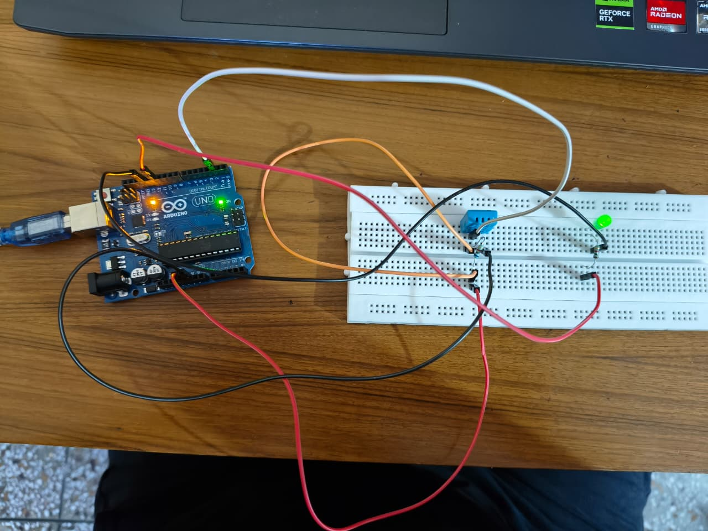

Readme · MD
# DHT11 Temperature & Humidity Monitor with LED Alert
 
Reads temperature and humidity from a DHT11 sensor and turns on an LED when the temperature crosses a set threshold.
 
## Photo
 

 
## What It Does
 
- Reads temperature and humidity from the DHT11 every 2 seconds
- Prints both readings to Serial Monitor
- Turns on an LED (and the Arduino's built-in LED) when temperature crosses 25°C
- Detects failed sensor reads and prints an error
## Components Used
 
- Arduino Uno
- DHT11 temperature & humidity sensor
- 2x Resistors (1k ohm with led ,6.8k ohm with DHT11)
- 1x LED
- Breadboard + jumper wires
## Wiring
 
| Arduino Pin | Connects To      |
|-------------|-------------------|
| 5V          | DHT11 VCC         |
| GND         | DHT11 GND         |
| Pin 2       | DHT11 Data        |
| Pin 12      | LED (+)           |
| GND         | LED (–)           |
 
## Library Used
 
- [`dht.h` by Rob Tillaart](https://github.com/RobTillaart/DHTlib) 
## How It Works
 
- `DHT.read11(dataPin)` reads the sensor and returns a status code
- DHT11 sensors fail to read correctly  often
- If the status isn't `DHTLIB_OK`, the reading is invalid and prints an error instead 
## Code
 
See [`temp_humidity_alert.ino`](temp_humidity_alert.ino) in this repo.
 
## What I'd Improve Next
 
- Add a separate threshold/alert for humidity
- Add an OLED/LCD display instead of relying only on Serial Monitor
- Switch to DHT22 for better accuracy
